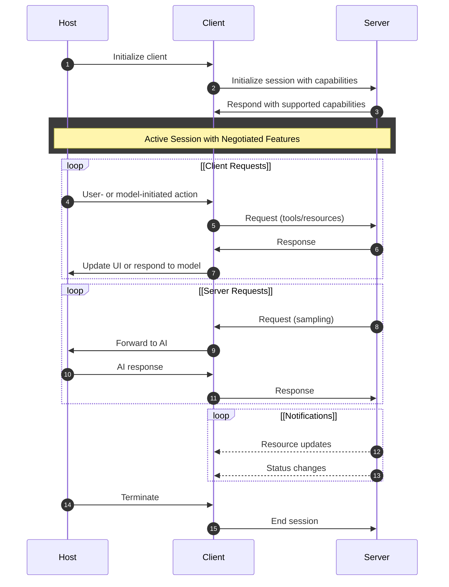

# Sequence Diagram - Host, Client, Server (Mermaid)

```mermaid
sequenceDiagram
    autonumber
    participant Host
    participant Client
    participant Server

    %% Initialization
    Host->>Client: Initialize client
    Client->>Server: Initialize session with capabilities
    Server->>Client: Respond with supported capabilities

    %% Active Session
    rect rgb(60,60,60)
        Note over Host,Server: Active Session with Negotiated Features
    end

    %% Client Requests Loop
    loop [Client Requests]
        Host->>Client: User- or model-initiated action
        Client->>Server: Request (tools/resources)
        Server->>Client: Response
        Client->>Host: Update UI or respond to model
    end

    %% Server Requests Loop
    loop [Server Requests]
        Server->>Client: Request (sampling)
        Client->>Host: Forward to AI
        Host->>Client: AI response
        Client->>Server: Response
    end

    %% Notifications Loop
    loop [Notifications]
        Server-->>Client: Resource updates
        Server-->>Client: Status changes
    end

    %% Termination
    Host->>Client: Terminate
    Client->>Server: End session
```
